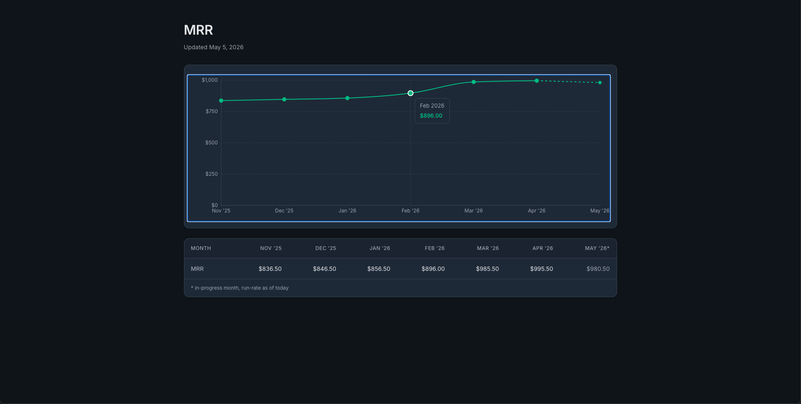

# Recurring Meadow

End-to-end MRR reporting pipeline backed by Stripe test data. 
A Python seeder that fills a Stripe sandbox with realistic subscription history, a BigQuery ETL, a SQL MRR query, a FastAPI wrapper, and a React dashboard.



---

## 1. One-time setup

```bash
python -m venv .venv
source .venv/bin/activate

# Backend (seeder, ETL, validation)
pip install -r requirements.txt

# API server
pip install -r api/requirements.txt

# Frontend
cd frontend && npm install && cd ..
```

Copy `.env.example` to `.env` and fill in:

```
STRIPE_API_KEY=sk_test_...
BIGQUERY_PROJECT=your-gcp-project-id

# Default dataset name. Change if you want a different one.
BIGQUERY_DB=stripe_raw 
```

BigQuery uses Application Default Credentials — once per machine:

```bash
gcloud auth application-default login
```

---

## 2. Generate the data (Stripe)

**Heads up: this takes ~1 hour to complete.** 
Stripe rate-limits API calls and each customer requires a chain of test-clock advances + polling — there's no way to parallelize it meaningfully. Run it once and leave it.

```bash
python -m scripts.seeder
```
The seeder simulates 180 days of a growth-stage SaaS using Stripe Test Clocks: customers go through `active` / `past_due` / `canceled` and tier upgrades / downgrades.

When the run finishes, a structured summary + per-customer event timeline is written to [output/seeder_events.txt](output/seeder_events.txt).

Seed Defaults ([scripts/seeder/config.py](scripts/seeder/config.py)):

---

## 3. Load the data (BigQuery)

```bash
python -m scripts.etl
```

The MRR query lives in [sql/mrr_monthly.sql](sql/mrr_monthly.sql). It returns one row per month for the simulation window plus a `(now)` row for in-progress MRR.

---

## 4. Start the API

> **Steps 4 and 5 are long-running servers.** Open a new terminal for each — the API in one, the frontend in another — and leave both running. Step 5 won't connect to anything until step 4 is up.

```bash
.venv/bin/uvicorn api.main:app --reload --port 8000
```

---

## 5. Start the frontend

```bash
cd frontend && npm run dev
```

Open <http://localhost:5173>.

---

## Validation

Cross-checks the BigQuery SQL against an independent per-customer Python walk, plus a per-customer audit:

```bash
python -m scripts.validate_mrr
```

Three stages: a sanity check on totals, a per-customer reconstruction comparing Python and BigQuery to the cent, and a per-customer audit pairing events with computed MRR. Full details in [METHODOLOGY.md](METHODOLOGY.md).

Output goes to stdout and [output/validation_output.txt](output/validation_output.txt). On any divergence in Stage 2, a per-customer breakdown for the failing month is appended.

The committed [output/seeder_events.txt](output/seeder_events.txt) and [output/validation_output.txt](output/validation_output.txt) are from my most recent end-to-end run. They show what the seeder timeline and validation report look like without requiring you to re-run the pipeline. Both files get overwritten when you re-run the seeder or validation script.

---

## Tests

```bash
pytest
```

Unit-tests cover the seeder helpers (catalog, clocks, customers, simulator, subscriptions, stripe_client, config). Integration scripts (`scripts.etl`, `scripts.validate_mrr`, `scripts.seeder`) are exercised by running them.

---

## Repo layout

```
scripts/
  etl.py                   # Stripe → BigQuery
  validate_mrr.py          # SQL ↔ Python cross-check
  seeder/                  # python -m scripts.seeder
    __main__.py            # orchestrator
    simulator.py           # pure-Python event generator
    event_handler.py       # event → Stripe API call
    config.py              # tunable knobs (seed, scale, probabilities)
    catalog.py             # idempotent product/price catalog
    clocks.py              # test-clock helpers
    customers.py           # customer + payment-method helpers
    subscriptions.py       # subscription helpers
    stripe_client.py       # SDK init from .env
sql/
  mrr_monthly.sql          # MRR per month, with is_current flag
api/
  main.py                  # FastAPI wrapping mrr_monthly.sql
frontend/                  # Vite + React + Recharts dashboard
tests/                     # pytest unit tests for seeder helpers
output/                    # generated artifacts (seeder log, validation report)
refs/                      # reference docs for claude code (pricing, seeder spec)
```
